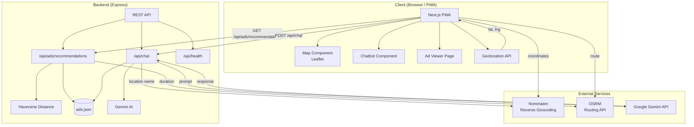
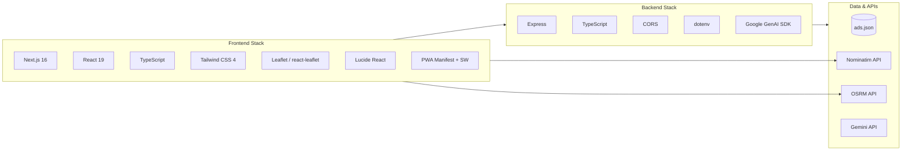
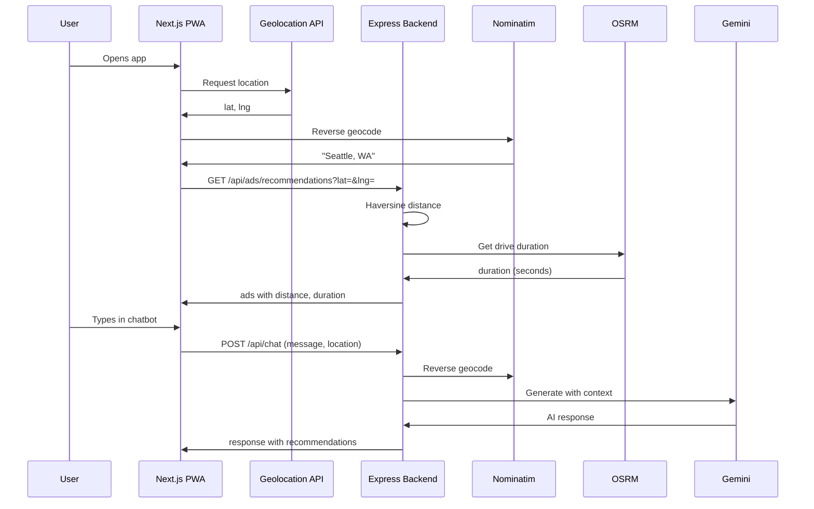
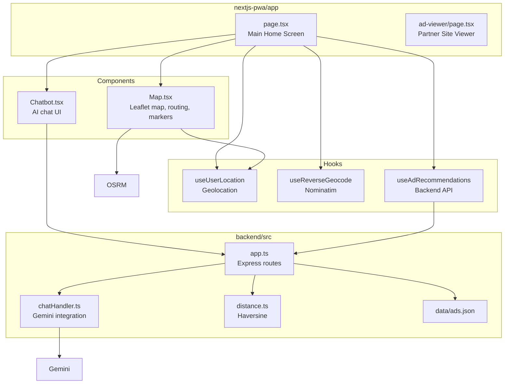
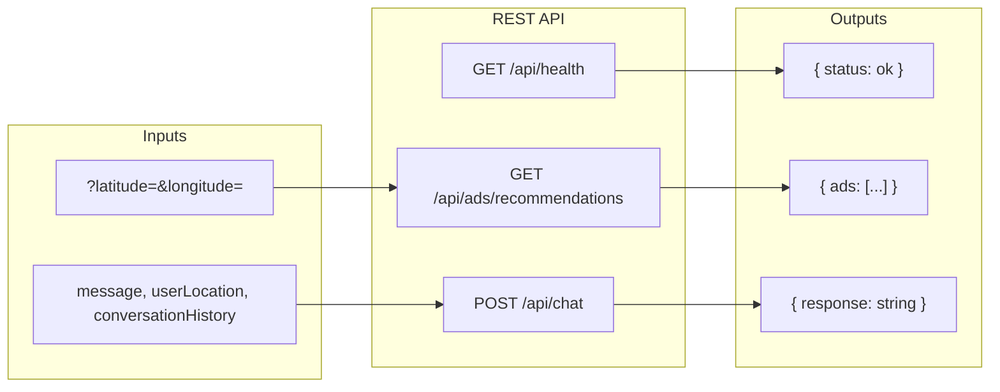

# Ridelytics — Technical Architecture

This document describes the technical architecture, tech stack, and data flows of the Ridelytics location-based ad PWA.

---

## System Architecture Diagram

---

## Tech Stack Diagram

---

## Data Flow Diagram

---

## Component Architecture

---

## API Endpoints Diagram

---

## Technologies Summary

| Layer | Technologies |
|-------|--------------|
| **Frontend** | Next.js 16, React 19, TypeScript, Tailwind CSS 4, Leaflet, react-leaflet, Lucide React |
| **Backend** | Node.js, Express, TypeScript, @google/genai, CORS, dotenv |
| **Storage** | JSON file (ads.json) |
| **External APIs** | Nominatim (reverse geocoding), OSRM (routing), Google Gemini (AI) |
